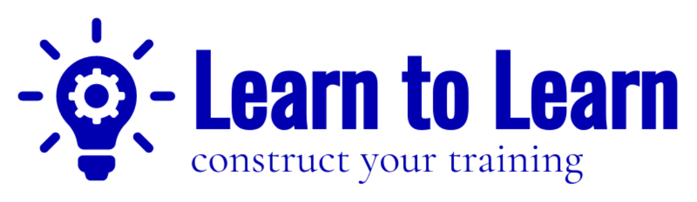

# Выпускной проект для школы программирования Elbrus Bootcamp 
### Мультиплатформенное мобильное приложение, для помощи в обучении. || A multi-platform mobile application to aid in learning.
Обучаясь в Эльбрусе, мы столкнулись с тем что по пути домой многие хотят, как то с пользой провести время в дороге.  
Но порой найти нужную информацию  по теме на github или в слаке бывает сложно и долго.  
И нам пришла идея сделать мобильное приложение в котором будет удобно получать доступ к информации.  
Представляем вашему вниманию приложение - универсальный конструктор обучающих материалов Learn to Learn.  
Его ключевыми особенностями является:  
* применимость для любой отрасли где требуется дать доступ пользователям к учебным материалам.
* Оно подойдёт как для большой большой компании так и в индивидуальном использовании. 
* Простой несложный интерфейс, мобильность, дружественный интерфейс, легкая масштабируемость и цветовая индивидуализация.
Приложение находится в стадии доработки.
